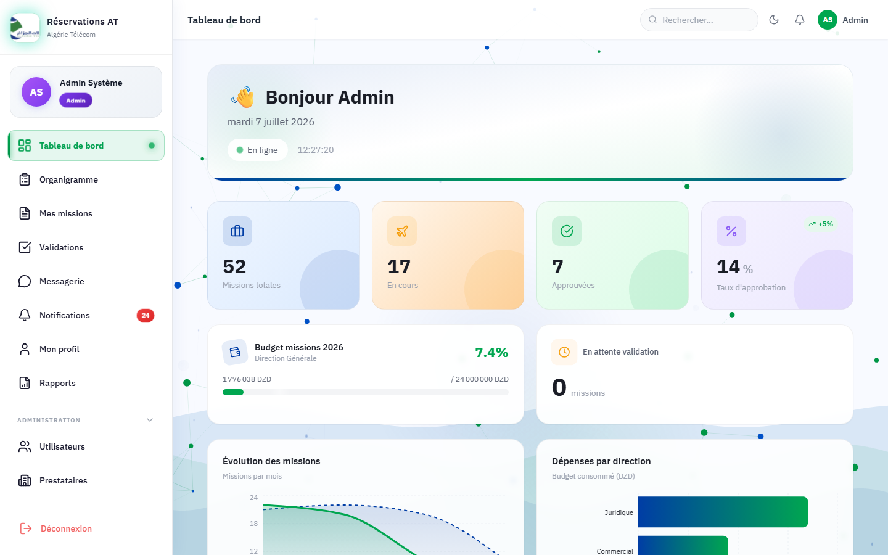
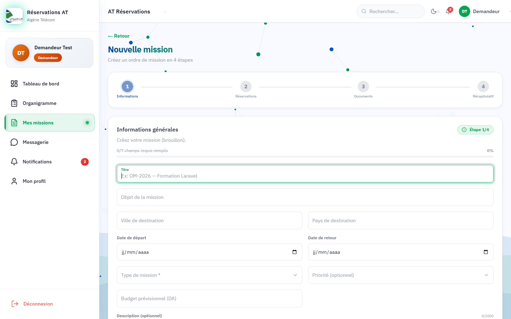
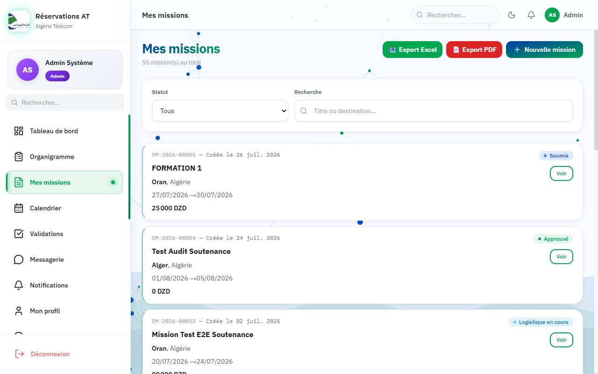
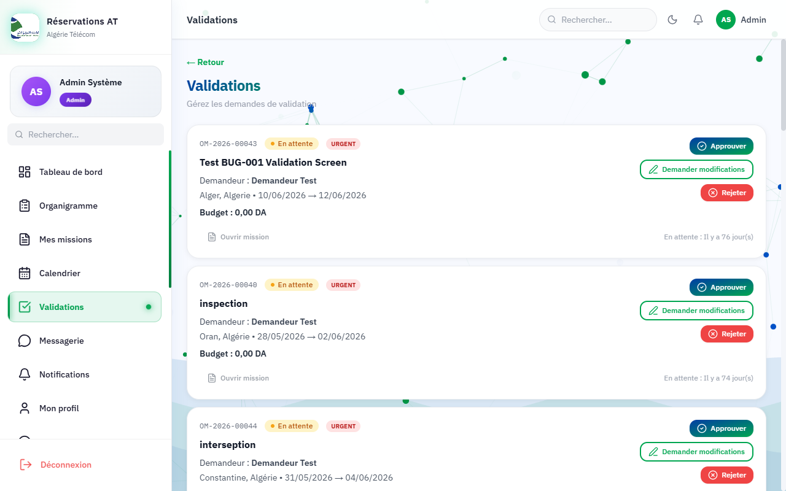
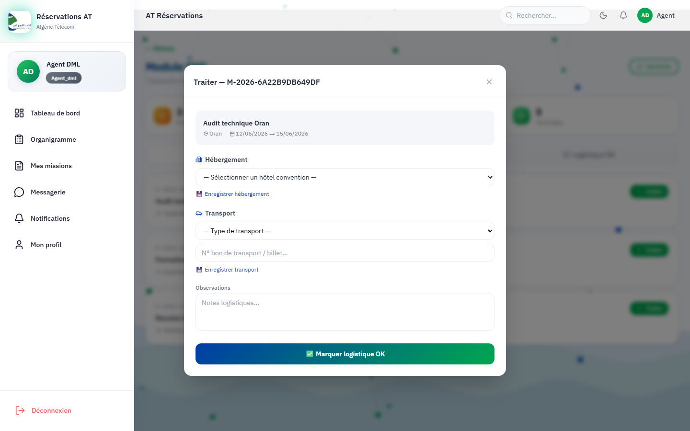
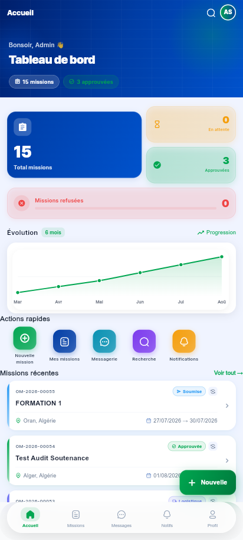
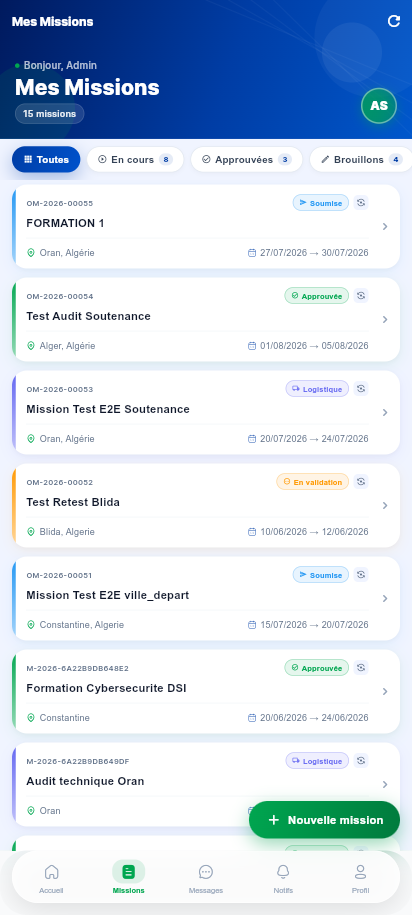
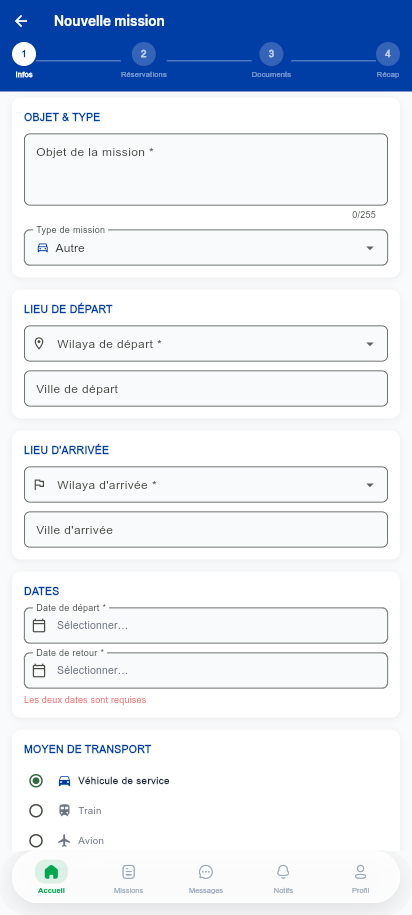
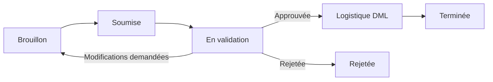
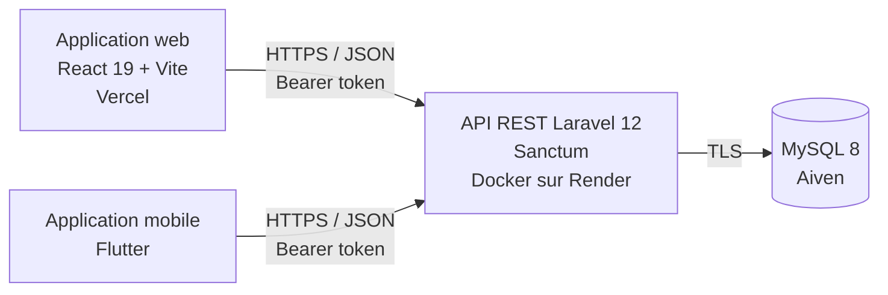

# AT Réservations — Gestion des ordres de mission

Plateforme **web et mobile** de gestion des déplacements professionnels, conçue pour **Algérie Télécom** : de la création d'un ordre de mission jusqu'à sa validation hiérarchique et à l'organisation logistique (hôtel, transport, budget).


> Projet de fin de formation — noté **17/20**.

| | Lien |
|---|---|
| Application web | https://at-reservation.vercel.app |
| API REST | https://at-r-servation.onrender.com/api |

L'application est réservée aux comptes créés par un administrateur : il n'y a pas de compte de démonstration public. Les captures ci-dessous montrent les principaux écrans.

---

## Aperçu

| Tableau de bord (admin) | Création d'une mission (assistant en 4 étapes) |
|---|---|
|  |  |

| Liste des missions | Circuit de validation |
|---|---|
|  |  |

| Traitement logistique (agent DML) |
|---|
|  |

**Application mobile (Flutter)**

| Accueil | Missions | Nouvelle mission |
|---|---|---|
|  |  |  |

---

## Fonctionnalités

### Par rôle

| Rôle | Ce qu'il peut faire |
|---|---|
| **Demandeur / Utilisateur** | Créer un ordre de mission (assistant en 4 étapes : informations, réservations, documents, récapitulatif), suivre son statut, recevoir les notifications |
| **Validateur (directeur)** | Approuver, rejeter (motif obligatoire) ou demander des modifications, avec indicateur d'urgence et d'ancienneté des demandes |
| **Agent DML (logistique)** | Traiter les missions approuvées : hôtel conventionné, transport, n° de billet, observations |
| **Administrateur** | Gérer les utilisateurs et leurs rôles, les prestataires, les budgets par direction, consulter les statistiques et le journal d'audit |

### Transverses
- **Cycle de vie complet d'une mission** : brouillon → soumise → en validation → approuvée / rejetée → logistique → terminée
- **Budgets** par direction avec suivi de consommation
- **Messagerie interne** et **notifications** en temps réel (polling)
- **Calendrier** des missions, **organigramme**, **recherche globale**
- **Exports PDF et Excel** (ordres de mission, listes, rapports)
- **Journal d'audit** des actions sensibles
- Thème clair / sombre, interface responsive
- **Mobile** : authentification biométrique, scan de billets (QR / code-barres) pour l'agent DML, géolocalisation, mode hors ligne (cache Hive)



---

## Architecture



| Couche | Technologies |
|---|---|
| **Backend** | Laravel 12, PHP 8.2, Laravel Sanctum (tokens), DomPDF, Laravel Excel, ~110 routes REST |
| **Frontend web** | React 19, Vite, Tailwind CSS, React Router 7, Chart.js, FullCalendar, Framer Motion |
| **Mobile** | Flutter / Dart, Provider, GoRouter, flutter_secure_storage, local_auth, Hive |
| **Base de données** | MySQL 8 |
| **Déploiement** | Frontend sur Vercel, API conteneurisée (Docker) sur Render, base managée sur Aiven |
| **Qualité** | PHPUnit (74 tests), Playwright (E2E, accessibilité, performance), ESLint, GitHub Actions |

Diagrammes UML : [cas d'utilisation](docs/diagrams/cas-utilisation.png) · [diagramme de classes](docs/diagrams/diagramme-classes.png) (sources PlantUML dans `docs/diagrams/`).

---

## Sécurité

- Authentification par **tokens Sanctum** avec expiration (8 h)
- **Contrôle d'accès par rôle** côté serveur sur chaque route sensible
- **Limitation de débit** : 5 tentatives de connexion par minute, 120 requêtes par minute pour l'API
- Inscription publique **fermée en production** : seuls les administrateurs créent les comptes
- **CORS** restreint au domaine du frontend en production
- Connexion à la base **chiffrée (TLS)**, mots de passe hashés (bcrypt), aucun secret versionné
- Compte administrateur initial créé à partir de variables d'environnement, jamais écrit dans le code

---

## Tests

```bash
cd backend
php artisan test          # 74 tests PHPUnit (base MySQL requise)

cd frontend
npx playwright test       # tests E2E (application lancée en local)
```

---

## Installation en local

**Prérequis** : PHP 8.2+, Composer, Node.js 20+, MySQL 8 (par exemple via XAMPP), Flutter 3 pour le mobile.

```bash
git clone https://github.com/michoumichou511-cyber/AT-r-servation.git
cd AT-r-servation
```

**Backend**
```bash
cd backend
composer install
cp .env.example .env
php artisan key:generate
# Dans .env : DB_HOST=127.0.0.1, DB_DATABASE, DB_USERNAME, DB_PASSWORD
php artisan migrate --seed
php artisan serve --port=8000
```

**Frontend**
```bash
cd frontend
npm install
npm run dev               # http://127.0.0.1:5173
```

**Mobile**
```bash
cd mobile/at_reservations_mobile
flutter pub get
# Par défaut l'application utilise l'API en ligne. Pour une API locale :
flutter run --dart-define=API_BASE_URL=http://10.0.2.2:8000/api
flutter build apk --release
```

En local uniquement, la page de connexion propose des comptes de démonstration créés par les seeders.

---

## Déploiement

| Service | Configuration |
|---|---|
| **Vercel** (frontend) | Dossier racine `frontend`, variable `VITE_API_URL` |
| **Render** (API) | Dossier racine `backend`, build Docker (`backend/Dockerfile`) : migrations, cache des routes, OPcache et 4 workers PHP au démarrage |
| **Aiven** (MySQL) | Connexion TLS, certificat CA fourni par la variable `MYSQL_CA_CERT` |

---

## Auteur

**michoumichou511-cyber** — [GitHub](https://github.com/michoumichou511-cyber)
